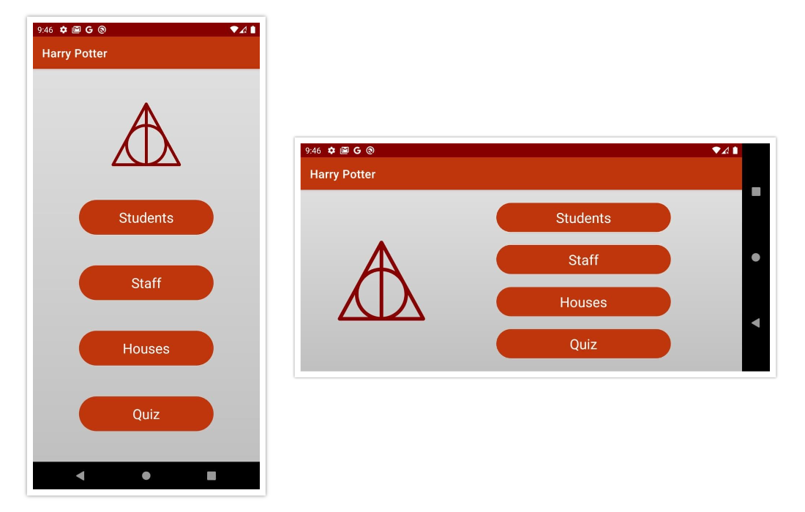
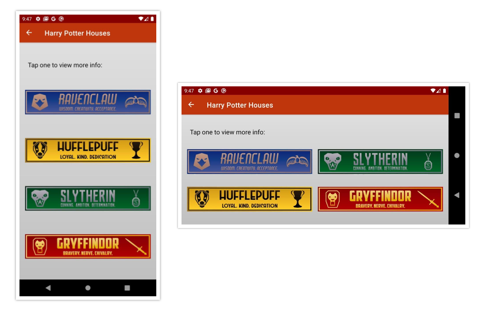

# Harry Potter Characters
App which fetches data from a public API about *Harry Potter* characters and display it in a RecyclerView.
Libraries used are **Retrofit**, **Gson**, and **Picasso**. Also uses some **Android Jetpack libraries**.

Layouts for **landscape** were also built.

## Screenshots

